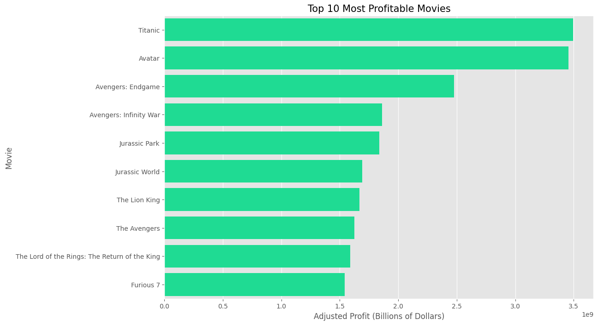
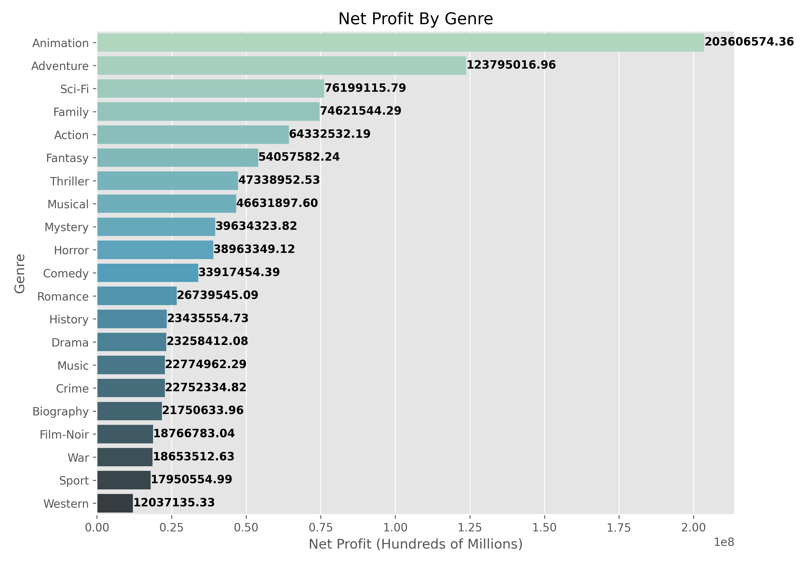
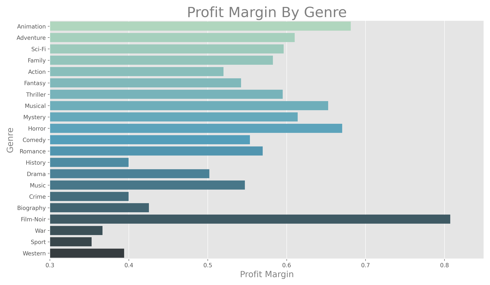
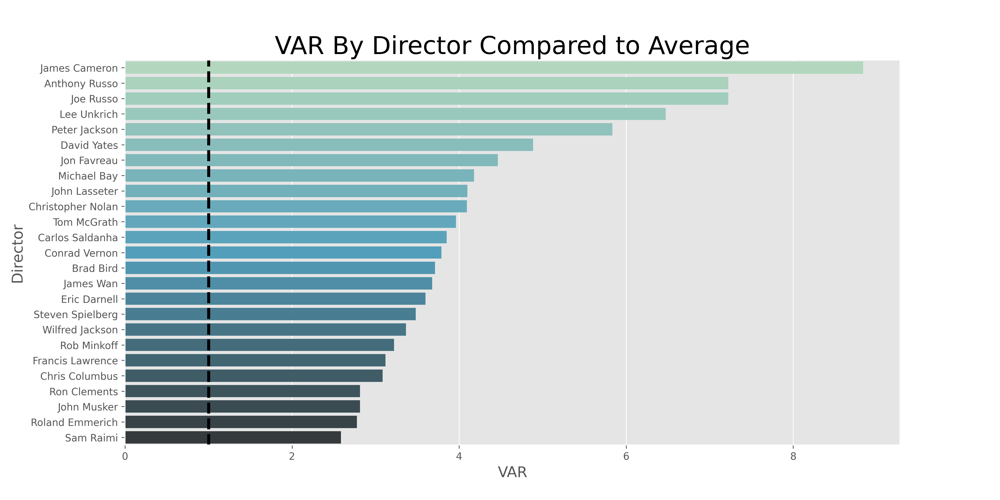

# Project Overview

*Our hypothetical company has announced that they would like to enter the movie industry and establish their own studio. However, they have limited knowledge of the movie industry. The goal of this project is to collect, clean, and analyze movie data from various sources to provide recommendations that will enable the company to succeed in the movie industry.*


## Python Libaries Used
### *pandas, numpy, seaborn, matplotlip, datetime*


## Data and Exploration
### Web-scrapping<br />

The web-scraped data used in this project was collected from the following sources:

1. https://www.the-numbers.com/movie/budgets/all/1
2. https://www.imdb.com/search/title/?title_type=feature&num_votes=5000,&languages=en&sort=boxoffice_gross_us,desc&start=1&explore=genres&ref_=adv_nx
3. https://www.boxofficemojo.com/chart/most_theaters/?by_studio_type=major
4. https://www.moviefone.com/movies/2019/?page=1
5. https://en.wikipedia.org/wiki/List_of_Academy_Award-winning_films

### Exploration Questions <br />

In this analysis, we explore and answer the following questions:

1. What are the most profitable movies, and how much should you spend?
2. Which movie genres are most commonly produced, and does quantity equate to higher net profits?
3. What is the best time of the year to release a movie?
4. Which actors and directors tend to add the most value?

## Question 1: What are the most profitable movies and how much should you spend?

To answer this question and provide a recommendation we'll make use of a budgets dataframe called `imdb_budgets_df`. Our analysis will require that we use the data to calculate profit and profit margin.

```
imdb_budgets_df['Profit'] = imdb_budgets_df['Worldwide Gross'] - imdb_budgets_df['Production Budget']

imdb_budgets_df['Profit_Margin'] = (imdb_budgets_df['Worldwide Gross'] - 
                                    imdb_budgets_df['Production Budget'])/imdb_budgets_df['Worldwide Gross']
```

We will also create two columns called `Adjusted_Budget` and `Adjusted_Profit` where we recalculate a movie's budget and profit to account for inflation and allow us to perform analysis based on the value of the 2020 dollar.

We examine the overall trend of budget versus profit to see if there's any correlation.



We also take a look at the top 10 movies in terms of profit to understand their financial success and how closely we should attempt to emulate their budget. We can see in the graph below there are a few outliers so the median will end up being more useful in determining our final budget.

**Question 1 Conclusion:** Our Company should budget \$82,250,000 for a movie and that budget should correlate with a profit margin of 80\%.

## Question 2: Which movie genres are most commonly produced and does quantity equate to higher net profits?

We first count the number of movies in each genre and plot those results on a bar graph.
```
m_by_genre = genre_budgets_df.groupby('Genre', as_index=False)['Movie'].count().sort_values(by='Movie', ascending=False)
```
Using the same `groupby` method, we select the median net profit and profit margin for each genre. We use the median in this case as the mean is likely skewed by outliers. Outliers could either be movies with enormous profits or movies having negative profit.





Lastly, we look at the percent of net profit by genre. This informs us as to how Our Company should allocate their movie budget to various films.

**Question 2 Conclusion:** Animation, adventure, and sci-Fi have the highest net profit of all genres. Analysis of profit margin shows that in addition animation, adventure, and sci-fi, horrors and musicals also have financial success.

## Question 3: What is the best time of the year to release a movie?

We start by converting the dates from the `imdb_budgets_df` dataframe to a datetime object.  We then do a count by month to see the number of movies released in each month.

We plot the net profit by month for a small selection of genres.  We can see that there is a general trend amongst these genres for the profit in each month.


**Question 3 Conclusion:** We recommend that Our Company release the bulk of their movies, especially Animation, during the summer months (i.e. May-July). Adventure, Drama and Comedy movies would see similar success if released in November, but the recommendation remains to focus on summer.

## Question 4: Which actors and directors tend to add the most value?

In this section we are going to take a look at the average net profit across all movies. From there we want to determine which actors and directors consistently appear in movies where the net profit substantially exceeds the average. We will represent this in a field called Value Above Replacement(VAR). To further simplify this concept; if across all movies the average net profit is 100 dollars and the average net profit of movies from 'Actor: X' is 200 dollars he/she would have a VAR of 2. This number represents X times over the average. To eliminate outliers we will look at actors who appear in 10 or more movies and directors who work in 5 or more.

We'll use the `actors_df` dataframe, adjust for inflation, and calculate profit as we did in Question 1. Then filter by actors who have starred in 10 or more movies.

```
actor_counts = actors_df['value'].value_counts()
actor_list = actor_counts[actor_counts >= 10].index.tolist()
actors_df = actors_df[actors_df['value'].isin(actor_list)]
```

To calculate VAR:
```
actor_total = actors_df.groupby(['value'],  as_index=False)['Net Profit'].mean().sort_values(by='Net Profit', ascending=False)
actor_total['VAR'] = (actor_total['Net Profit']/actor_total['Net Profit'].mean())
```




**Question 4 Conclusion:** We recommend that Our Company focus their cast and crew search to individuals who consistently score at least 1.0 on the VAR score. We can, with a high level of confidence, conclude that these individuals will elevate the overall production.
